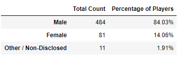
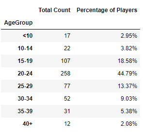
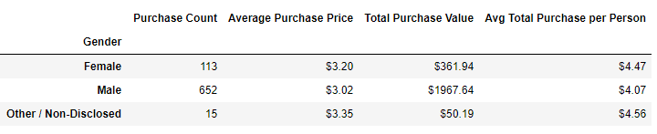
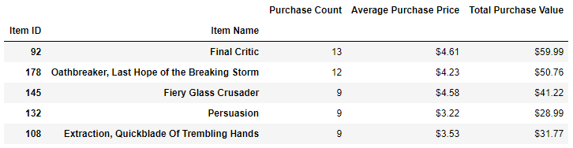
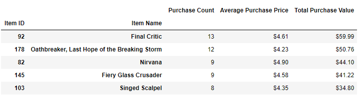

# Heroes of Pymoli Analysis
This project looks for meaningful insights from player demographics and their purchasing habits. 

## Files in the Repository
The main folder in the repository is [Heroes of Pymoli](./Heroes%20of%20Pymoli). This folder contains the Jupyter Notebook and Resources used for the analysis.

* [Heroes of Pymoli Notebook](./Heroes%20of%20Pymoli/HeroesOfPymoli.ipynb) 

* [Resources](./Heroes%20of%20Pymoli/Resources)

The Resources folder contains the original purchase_data.csv file and an individual_data.csv file that is generated by the analysis.

The [Images](./Images) folder contains screenshots of the results.

## Using the Jupyter Notebook 
Open in Jupyter and set the Kernel to Python 3.6. Run all to see output.

## Output
The code returns the following:

* Total Number of Players

* Analysis of Total Purchasing Data

* Gender Demographics

* Purchasing Analysis by Gender

* Age Demographics

* Purchasing Analysis by Age

* Top 5 Spenders

* Top 5 Most Popular Items

* Top 5 Most Profitable Items

Three observable trends from the analysis are:

1. The majority of the players are male (84%) and between the ages of 15 and 24 (63%). 

2. Male players buy more items (652), but tend to spend less per item (\$3.02) while players of other genders spend slightly more per item (\$3.20 & \$3.35). 

3. The two most popular items - *Final Critic (13 purchases)* and *Oathbreaker, Last Hope of the Breaking Storm (12 purchases)* - are also the most profitable at \$59.99 and \$50.76 respectively.

## Status
_finished_

## Inspiration
This project was assigned as part of the UTSA Data BootCamp.